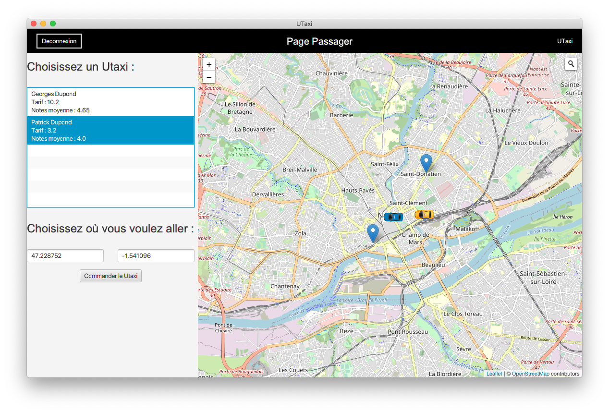

# UTaxi



UTaxi est un système de gestion de taxis inspiré d'Uber. Ce logiciel a été réalisé dans le cadre du projet de première année de DUT Informatique.

Réalisé par [Erwan Leflot](https://github.com/ErwanLeflot), [Manon Goasguen](https://github.com/Manon00), [Mathis Boultoureau](https://github.com/mboultoureau), [Rémi Bastille](https://github.com/WelcomeToZhaun) et [Ronan Renoux](https://github.com/ronanren).

## Sommaire

- [Explication de la structure du code](#explication-de-la-structure-du-code)
  - [Découpage en packages](#decoupage-en-packages)
- [Installation](#installation)
  - [Installation du Java Development Kit](#installation-du-java-development-kit)
  - [Installation sous Eclipse](#installation-sous-eclipse)
  - [Installation sous IntelliJ IDEA](#installation-sous-intellij-idea)
  - [Installation sous Visual Studio Code](#installation-sous-visual-studio-code)

## Explication de la structure du code

### Découpage en packages

Pour plus de simplicité, le code a été découpé en différents packages :

- admin : concerne toute l'administration, comme la gestion des passagers, des conducteurs.
- auth : concerne toute ce qui concerne l'authentification dont la connexion et l'inscription.
- core : concerne les classes de gestion dont le main (App), la gestion de la fenêtre (Windows) et la page du menu principal.
- dashboard : concerne toutes les pages principales comme la page conducteur et la page passager.
- debug : concerne tout ce qui permet de débugger. Le débogage peut être activé grâce à la variable `DEBUG` dans la classe App.
- exceptions : concerne toutes les exceptions.
- manager : concerne toutes les classes "logiques" de l'application.
- map : concerne tout ce qui concerne la carte.

## Installation

Cette section vous explique comment installer le projet sur différents logiciels : Visual Studio Code, Eclipse et IntelliJ IDEA. Nous vous recommandons ces deux derniers pour développer.

Si vous avez plusieurs versions du JDK sur votre système, il est possible qu'il faudrait configurer le chemin.

- Sous Linux et MacOS, ajouter les lignes suivantes à votre fichier `~/.zshrc` ou `~/.bashrc` :

```sh
export JAVA_HOME="/chemin/vers/java/jdk-14/bin"
export PATH="$PATH:$JAVA_HOME"
```

- Sous Windows, appuyez sur `Windows` + `Pause` pour ouvrir les propriétés systèmes, allez dans l'onglet "Avancé", cliquez sur le bouton "Variables d'environnement". Ajouter une propriété JAVA_HOME avec le chemin de votre JDK : C:\chemin\vers\java\jdk-14\bin. Modifiez également la propriété PATH en ajoutant le chemin vers Java à la fin :

```
;C:\chemin\vers\jdk-14.jdk\bin
```

### Installation du Java Development Kit

Pour exécuter le programme vous aurez besoin d'une version du Java Development Kit (JDK) récente. Ici, nous utiliserons la version 14, mais tout JDK dont la version est supérieure ou égale à 8 devrait fonctoonner.

- Rendez-vous tout d'abord sur le [site d'Oracle](https://www.oracle.com/java/technologies/javase-downloads.html) pour l'installer. Vous serez probablement amené à créer un compte l'installer.

### Installation sous Eclipse

- Cloner ou télécharger le dépôt.
- Aller ensuite dans `File > Import > Maven > Existing Maven Projects`. Dans Root Directory spécifier le chemin du projet et cliquer sur Finish.
- Pour exécuter le programme, cliquer sur la flèche à côté du bouton `Run > Run as > Maven build...`. Une fenêtre s'ouvre, dans Goals écrivez `javafx:run`. Vérifier également que le Base directory correspond bien à votre projet. Cliquez Apply puis Run.

### Installation sous IntelliJ IDEA

- Cloner ou télécharger le dépôt.
- Sur la page de démarrage, cliquer sur `Open or Import` et sélectionner le dossier UTaxi.
- En haut à droite, à côté de l'icone `Build project`, cliquer sur `Add configuration...`. Sur la fenêtre qui s'ouvre, cliquer sur `+` puis Maven.
- Dans Command line, écrivez `javafx:run`, puis cliquer sur `Apply` puis `OK`.
- En cliquant sur l'icone `Run`, l'application devrait démarrer.

### Installation sous Visual Studio Code

- Cloner ou télécharger le dépôt.
- Installer l'extension [Java Extension Pack](https://marketplace.visualstudio.com/items?itemName=vscjava.vscode-java-pack).
- Vous devez désormais installer Maven. Rendez-vous sur le site d'[Apache Maven](https://maven.apache.org/download.cgi) et télécharger l'archive et décompressez-la. Placez Maven dans un dossier facilement reconnaissable (par exemple : /Library/Java/Maven pour MacOS ou C:\Program Files\Maven pour Windows).
- Ajouter Maven au PATH :

  - Sous Linux ou MacOS, ajoutez les lignes suivante dans le fichier `~/.zshrc` ou `~/.bashrc` :

    ```sh
    export MAVEN_HOME="/chemin/vers/maven/Maven/bin"
    export PATH="$PATH:$MAVEN_HOME"
    ```

  - Sous Windows, appuyez sur `Windows` + `Pause` pour ouvrir les propriétés systèmes, allez dans l'onglet "Avancé", cliquez sur le bouton "Variables d'environnement". Modifiez la propriété PATH en ajoutant le chemin vers Maven à la fin :

    ```
    ;C:\chemin\vers\maven\Maven\bin
    ```

  - Paramètre optionnel : par défaut le dépôt de Maven est situé à l'adresse `~/.m2/repository` ce qui peut allourdir votre home. Vous pouvez changer cette valeur dans le fichier `~/.m2/settings.xml`. Consultez la [documentation d'Apache Maven](https://maven.apache.org/settings.html) pour en savoir plus.

- Tester votre installation de Maven avec la commande `mvn -v`.
- Ouvrer le projet dans Visual Studio Code, et entrer la commande `mvn javafx:run` dans votre terminal.
